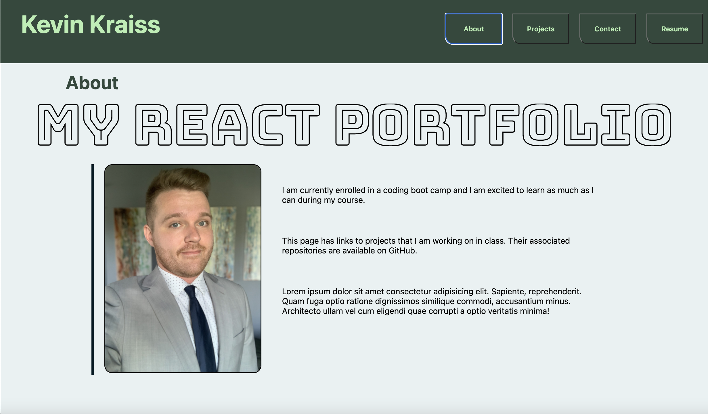

# Developer Portfolio using React

## Description
This application uses React to create a developer portfolio that shows a brief "About" page, a "Portfolio" page showing recent projects, a "Contact" page with a contact form, and a "Resume" page that allows potential employers to view and download a resume. This inital version focused on converting my old portfolio to a live React app, styling will be updated in the future. 

## Screenshot

## Links

[Github Repo](https://github.com/kevinkraiss/react-developer-portfolio/)

[Live Application](https://kevinkraiss.github.io/react-developer-portfolio/)